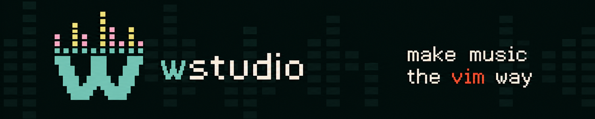

# wstudio

<p align="center">
  
</p>

A keyboard-centric digital audio workstation written in
[Zig](https://ziglang.org/) (0.16).

## Pitch

Make music the vim way. wstudio borrows the modal model from vim:

- **normal**: navigate the project, drive the transport (`space`
  play/stop, `hjkl` with counts, `gg`/`G`, ...)
- **insert**: the keyboard becomes a piano: the a-row plays white keys
  (`a` = C, `s` = D, `d` = E, ...) and the q-row plays black keys;
  `z`/`x` shift octaves
- **visual**: `v` selects a range (steps in the piano roll/drum grid,
  bars in the arrangement); `y`/`d`/`P` yank, clear, or paste it, `esc`
  cancels
- **command**: ex-style `:` commands

And it ships batteries included: synths, samplers, a drum machine, a
sample-chopping slicer, and a full effects rack (gate, compression, EQ,
saturation, bitcrush, chorus, phaser, delay, reverb) are built in. No
plugin hunting before the first note.

## Status: beta

The first public beta is live and audible. Expect rough edges and project-file
backups are recommended while the format continues to evolve. `wstudio` opens
a TUI with a single blank
track; press `enter` to pick an instrument (synth, sampler, or drum
machine) and a per-track FX rack. Vim-style modal control drives it,
with live keyboard playing through PipeWire, JACK, or ALSA on Linux
(tried in that order; PipeWire and JACK are loaded at runtime, so any
desktop works) or WASAPI on Windows; a silent wall-clock backend takes
over when no device exists, and `wstudio.o.audio_backend` in init.lua
forces a specific one. Terminals
smaller than 80x14 get a resize notice instead of a layout.

- `wstudio`: new, empty session (one blank track)
- `wstudio demo.wsj`: the curated four-track demo (lead, e-piano, bass, drums),
  arranged into a 16-bar song; opens in song mode, so `space` sweeps the
  timeline (press `A`, then `T` to compare with pattern mode)
- `wstudio render`: the offline pipeline demo rendered to a WAV

Tracks start blank: `enter` on a blank track opens the instrument
picker. Synth and sampler tracks are piano-roll sequenceable (`p`);
drum-machine tracks open the step grid (`enter`), where `e` opens the
per-pad sampler editor and `[`/`]`/`N` manage up to 8 pattern variants
(A to H) per machine. `A` opens the arrangement view, where clips
stamped from the live patterns are placed on a bar timeline; on drum
lanes `[`/`]` pick which variant to stamp (clips show their letter),
and `T` toggles between pattern and song playback. `:load <file>` loads
the WAV type appropriate to the current view: a sampler or drum pad sample,
a slicer clip, a synth wavetable, or a whole sampler clip in Arrangement.
File paths given to `:load`, `:write`, and
`:bounce`/`:export`/`:bounce-stems` expand a leading `~` to `$HOME`.
`:bounce`/`:export` take an optional trailing `16`/`24` to pick the WAV
bit depth (default 16) and bounce exactly an armed A/B loop region
instead of the whole song/pattern when one is set; `:bounce-stems
[dir] [16|24]` renders every non-empty track soloed in turn to
`<dir>/<track-name>.wav` (default `stems/`). `:edit <file>` opens
a different project without restarting wstudio (refusing on unsaved
changes; `:edit!` forces it, and `:edit!` alone reverts to the last save);
`:new`/`:new!` start a blank project the same way.

## Architecture

```
src/
├── root.zig            engine library root (public API)
├── main.zig            CLI frontend (imports the library)
├── core/
│   ├── types.zig       sample format, unit conversions (frames/seconds/dB)
│   ├── ring_buffer.zig lock-free SPSC queue (the control <-> audio bridge)
│   └── wav.zig         minimal WAV reader/writer for samples and bounce
├── input/
│   └── modal.zig       vim-style modal input: modes, counts, sequences,
│                       piano key layout; pure state machine, UI-agnostic
├── ui/                 frontend-agnostic layer shared by tui/ and gui/
│   ├── app.zig         the App: view/modal state, key+mouse dispatch,
│   │                   session lifecycle, Lua host hooks
│   ├── commands.zig    the `:command` layer (table-driven via cmd.zig)
│   ├── editors/        per-view input logic: one handler per view
│   ├── status.zig      per-view footer renderers (both frontends draw them)
│   ├── help.zig        help content model: sections, text build, search
│   ├── history.zig / undo.zig   undo/redo capture and swap mechanics
│   ├── ansi.zig         shared SGR palette + status badge helpers
│   ├── icons.zig        Nerd Font icon glyphs (see assets/fonts/LICENSE)
│   └── cmd.zig, synth_layout.zig, fuzzy.zig, json_store.zig,
│       user_presets.zig, user_drum_kits.zig, bookmark_store.zig,
│       cmd_history_store.zig   smaller shared stores/utilities
├── tui/
│   ├── terminal.zig    raw mode + ANSI frames (POSIX termios)
│   ├── terminal_windows.zig  same, via the Windows Console VT100 mode
│   ├── input_decode.zig  ANSI/VT byte decoding shared by both terminals
│   ├── main.zig         TUI shell: terminal lifecycle, run loop, frame draw
│   ├── style.zig        TUI-only output primitives (re-exports ui/ansi.zig)
│   └── views/           one renderer per view: tracks, piano roll, drum
│                        grid, sampler editor, arrangement, spectrum, ...
├── gui/
│   ├── main.zig         GLFW/ImGui lifecycle, fonts, audio host, run loop
│   ├── app.zig          GUI App wrapper, input mapping, view dispatch
│   ├── chrome.zig       transport/status/command-prompt chrome
│   └── views/           one ImGui renderer per view
├── transport.zig       playhead, tempo, musical time
├── project.zig         the document: tracks, settings (control side)
├── session.zig         session factory, track lifecycle, engine wiring
├── arrangement.zig     song mode: per-track clips on a bar timeline
├── persist.zig         project save/load (.wsj JSON snapshots, see FORMAT.md)
├── midi.zig            MIDI protocol types and raw-byte parser
├── dsp/
│   ├── device.zig      Device interface (instruments + effects)
│   ├── synth.zig       polyphonic synth (sine/saw/square, ADSR)
│   ├── sampler.zig     chromatic single-clip sampler
│   ├── drum_sampler.zig step-sequenced 64-pad drum machine (banks of 8)
│   ├── slicer.zig      step-sequenced sample chopper (one clip, up to 64 slices)
│   ├── drum_kit.zig    synthesis factory for the shipped kit samples
│   ├── pattern.zig     piano-roll pattern sequencer
│   ├── eq.zig          8-band parametric EQ (peak/lowpass/highpass)
│   ├── compressor.zig  feed-forward stereo-linked compressor (sidechain)
│   ├── multiband_comp.zig  3-band compressor, classic or OTT style
│   ├── ott.zig         OTT as its own unit: the multiband squash, pre-tuned
│   ├── gate.zig        noise gate
│   ├── saturator.zig   tanh soft-clip saturator
│   ├── crusher.zig     bitcrusher (bit depth + sample-rate reduce)
│   ├── chorus.zig      LFO-modulated-delay stereo chorus
│   ├── phaser.zig      4-stage allpass stereo phaser
│   ├── delay.zig       stereo feedback delay
│   ├── reverb.zig      Freeverb-style reverb
│   └── spectrum.zig    FFT analyser feeding the spectrum view
└── audio/
    ├── engine.zig      RT engine: command queue, track device chains,
    │                   mixing, metering, atomic UI snapshots
    ├── backend.zig     backend interface, offline renderer,
    │                   real-time-paced null backend
    ├── host.zig        backend selection shared by both frontends
    ├── pipewire.zig    PipeWire playback backend (dlopened, RT stream)
    ├── jack.zig        JACK playback backend (dlopened, callback-driven)
    ├── alsa.zig        ALSA playback backend (device-clock paced)
    ├── wasapi.zig      WASAPI playback backend (Windows, event-driven)
    └── midi_in.zig     ALSA sequencer MIDI input (virtual port)
```

Three rules hold everything together:

1. **The audio thread never blocks.** `Engine.process` is allocation-free
   and lock-free; all mutation arrives via the SPSC command queue.
   Device buffers are allocated up front, never in `process`.
2. **The engine is a library.** Frontends (TUI and GUI) import
   `wstudio` and talk to the engine only through its public API.
3. **Input is a pure state machine.** Key to action mapping lives in
   `input/modal.zig` with no UI dependency, so bindings are unit-tested
   and identical across frontends.

Longer-form design notes (the shared vim editing grammar, TUI layout
conventions) live in [docs/](docs/README.md); the save format and its
version history in [FORMAT.md](FORMAT.md).

Bug reports and focused contributions are welcome during the beta. See
[CONTRIBUTING.md](CONTRIBUTING.md) for the reporting checklist and development
checks.

## Building

```sh
nix develop          # zig, zls, audio libs
zig build run        # launch the TUI (space = play, i = piano mode, :quit = quit)
zig build run -- demo.wsj  # open the curated four-track demo project
zig build run -- --gui demo.wsj # open the GUI, optionally with a project
zig build run -- render  # offline demo: melody through the chain -> out.wav
zig build -Dgui=false  # build without the GUI frontend and its dependencies
zig build -Dtui=false  # build without the TUI frontend
zig build test       # all tests
zig build check      # all tests plus a fresh wstudio executable build
zig build genkit     # re-render the embedded drum kit (after editing drum_kit.zig)
zig build gendemo    # re-write demo.wsj (after editing tools/gendemo.zig)
zig build install-font # install the TUI's icon font (see below)
nix build            # packaged build via zig.hook
zig build -Dtarget=x86_64-windows-gnu  # cross-compile the Windows build
```

### Lua configuration

wstudio loads `$XDG_CONFIG_HOME/wstudio/init.lua` when that variable is set.
Otherwise it loads `~/.config/wstudio/init.lua` on Unix-like systems and
`%APPDATA%\wstudio\init.lua` on Windows, then falls back to
`/etc/xdg/wstudio/init.lua`. When neither file exists, wstudio creates the user
file from its embedded configuration template. The API covers options,
keymaps, user `:` commands, autocmd events, and transport/track scripting:

```lua
wstudio.o.default_tempo = 128
wstudio.keymap.set("n", "gp", ":bpm 140", { desc = "jump to 140 BPM" })
wstudio.api.create_autocmd("PlaybackStart", { callback = function(ev)
  wstudio.notify("rolling at " .. ev.tempo .. " BPM")
end })
```

[examples/init.lua](examples/init.lua) is the fully documented template used
for first-run generation: every option with its default and range, the key
notation, all events, and
the whole `wstudio.api` surface. Uncomment what you need in the generated file;
[docs/lua-api.md](docs/lua-api.md) covers the design. A broken
config never blocks startup. Nix users can enable wstudio through
`nixosModules.default` or `homeManagerModules.default`. The Home Manager and
NixOS modules offer typed settings or raw Lua as mutually exclusive
configuration methods:

```nix
programs.wstudio = {
  enable = true;
  settings = {
    default_tempo = 128;
    tui_mouse = false;
    gui_theme = "patina_light";
  };
};
```

Use `luaConfig` instead when configuring keymaps, commands, or other parts of
the Lua API.

### Icons

The TUI uses a 16-glyph subset of [Symbols Nerd Font
Mono](https://github.com/ryanoasis/nerd-fonts) (MIT; see
`src/assets/fonts/LICENSE`) for instrument-kind markers, transport
play/stop, loop/help/EQ/timeline titles, and an unsaved-changes warning.
The subset is embedded in the binary and defined in `src/ui/icons.zig`.
The icons are additive: every icon sits next to existing
text/ASCII, never replacing it, so the TUI stays fully legible without
the font. To see them rendered, run `zig build install-font` (writes
`wstudio-icons.ttf` to your font directory), then `fc-cache -f` and add
it as a fallback font in your terminal. It only needs to cover a
handful of Private Use Area codepoints, so it layers cleanly under
whatever font you already use.

Separately, the TUI's box-drawing borders (`─│┃━┏┓┗┛` etc., standard
Unicode U+2500 block) need a terminal font with those glyphs, unrelated
to the icon font above. Some default Windows Terminal font profiles don't
cover them and render blank/tofu instead; switching to a font with full
box-drawing coverage (most monospace programming fonts, e.g. Cascadia
Code) fixes it.

## License

MIT

`src/assets/fonts/wstudio-icons.ttf` is a subset of Symbols Nerd Font
Mono (MIT); see `src/assets/fonts/LICENSE`.
