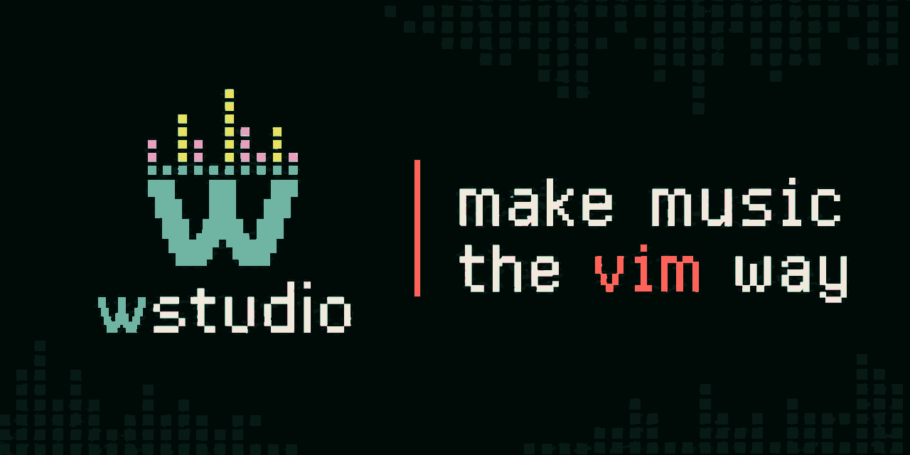

# wstudio

<p align="center">
  
</p>

A keyboard-centric digital audio workstation written in
[Zig](https://ziglang.org/) (0.16), for the terminal and as a native GUI.

wstudio borrows vim's modal model instead of a mouse-first workflow:
**normal** mode navigates the project and drives the transport, **insert**
turns the keyboard into a piano, **visual** selects and yanks ranges, and
**command** mode runs `:` commands. It ships with grand and upright pianos, a
harpsichord, synths, samplers, a drum machine, a sample-chopping slicer, and a
full effects rack (gate, compressor,
multiband compressor, OTT, limiter, transient shaper, EQ, multimode filter, utility, stereo width, auto-pan/tremolo, saturation, bitcrush, chorus, phaser, flanger,
tape, frequency shifter, delay, reverb) built in, so there's no plugin
hunting before the first note.

## Quickstart

```sh
nix develop                     # zig, zls, audio libs
zig build run                   # launch the TUI on a blank project
zig build run -- demo.wsj       # open the curated four-track demo
zig build run -- --gui demo.wsj # open the GUI instead
zig build run -- render demo.wsj demo.wav # render saved project without frontend
zig build run -- render-stems demo.wsj stems # render each track without frontend
```

On Linux, devShell also supplies Odin 2 for CLAP checks and LSP Plugins for
VST3 checks. Launch either frontend with
`-u tools/plugin_test_init.lua` to scan only those known plugins.

Without Nix, install Zig 0.16 and ALSA development libraries (Linux only)
and build the same way; see [CONTRIBUTING.md](CONTRIBUTING.md) for the
full development setup. Once running: `enter` on a blank track opens the
instrument picker, `space` plays/stops, and `:help` lists every command.
Choosing `Acoustic / SoundFont` starts with bundled grand piano. Use
`:library <name>` or press `f` to browse bundled pianos, organ, harp, mallets,
and kalimba.

## External plugins

wstudio hosts stereo CLAP instruments and effects using the
[CLAP 1.2 ABI](https://github.com/free-audio/clap). Discovery follows
`CLAP_PATH` and the platform paths required by the CLAP specification.

```sh
wstudio clap-scan
```

List backend-native audio and live MIDI device IDs with `wstudio devices`.
Use those values for `wstudio.o.audio_output_device`,
`wstudio.o.audio_input_device`, and `wstudio.o.midi_input_device`.
Explicit playback devices fail with backend error instead of silently switching
to silent playback.

The instrument and effect pickers divide devices into `Internal` and
`External` sections. External CLAP plugins are scanned automatically from
the platform's canonical directories. Set
`wstudio.o.clap_plugin_path = "/path/to/clap"` in `init.lua` to scan only a
fixed custom directory instead.

wstudio also hosts VST3 instruments and effects. Discovery uses standard Linux,
Windows, and macOS VST3 directories. Set
`wstudio.o.vst3_plugin_path = "/path/to/vst3"` to scan one custom directory,
or inspect discovery with:

```sh
wstudio vst3-scan
```

VST3 supports one mono or stereo main output for instruments, and one mono or
stereo main input and output for effects. Notes, mapped MIDI CC and pitch bend,
transport, generic parameter editing, opaque component/controller state,
latency queries, and restart notifications are supported. Native VST3 editor
windows, multiple buses, sidechains, surround, and sample-accurate parameter
ramps are not supported.

The scan prints `<plugin-id> <name> <path>`. In either frontend, select a
track and use:

```text
:clap-instrument <plugin-id> <path>
:clap-fx <plugin-id> <path>
:clap-param <1-based-index> [plain-value]
```

CLAP audio, notes, MIDI, transport, parameters, opaque state, latency, tails,
logging, main-thread callbacks, parameter flushes, dirty-state notifications,
and plugin-owned floating GUI windows are supported. Use `:clap-gui` on a CLAP
instrument or focused effect to toggle its window. Plugin identity and state are
saved in the `.wsj` project. Embedded plugin GUIs, surround buses, polyphonic
modulation, plugin-requested restarts, and plugin-requested thread pools are not
supported yet.

External controller input currently consumes MIDI 1.0 Channel Voice events
through ALSA sequencer. MIDI 2.0 Universal MIDI Packets, per-note controllers,
profiles, and property exchange are not implemented, and are not advertised as
supported. The raw MIDI 1.0 parser covers Channel Voice and System Realtime;
System Common and SysEx input are intentionally ignored.

## Status: beta

The first public beta is live and audible. Expect rough edges, and keep
project-file backups while the `.wsj` format continues to evolve. Linux is
used daily by the maintainer and is the most exercised platform; Windows has
had some manual testing, with TUI, GUI, and audio confirmed working. macOS
has no hardware available to test on: it only gets CI compiling and running
the test suite, with no human having run it. If you're on a Mac, trying it
and reporting back is one of the most useful things you can do right now.
See [CONTRIBUTING.md](CONTRIBUTING.md) to report a bug or send a focused
change.

## Configuration

wstudio is scripted with Lua: options, keymaps, custom `:` commands,
autocmds, and the project itself, down to notes, drum steps, FX chains, and
arrangement clips. On first run it writes a fully documented template to the
[user configuration directory](docs/user-config-storage.md) as `init.lua`
(see [examples/init.lua](examples/init.lua));
a broken config never blocks startup. The full API is documented in
[docs/lua-api.md](docs/lua-api.md). Nix users can enable wstudio via
`nixosModules.default` or `homeManagerModules.default`, configuring it
with typed settings or raw Lua:

```nix
programs.wstudio = {
  enable = true;
  settings.default_tempo = 128;
};
```

## Learn more

- [docs/](docs/README.md) - editing grammar, UI conventions, undo/redo,
  and GUI color identity
- [CHANGELOG.md](CHANGELOG.md) - what changed in each release
- [FORMAT.md](FORMAT.md) - the `.wsj` save format and its version history
- [CONTRIBUTING.md](CONTRIBUTING.md) - bug reports and development setup

## License

MIT. `src/assets/fonts/wstudio-icons.ttf` is a subset of Symbols Nerd Font
Mono (MIT); see `src/assets/fonts/LICENSE`.
